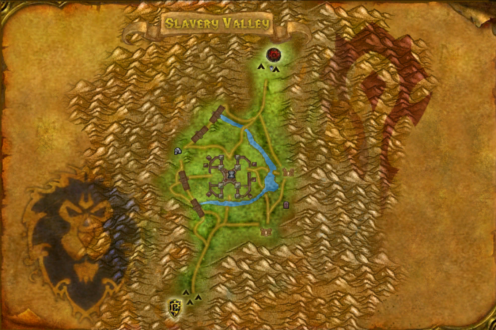
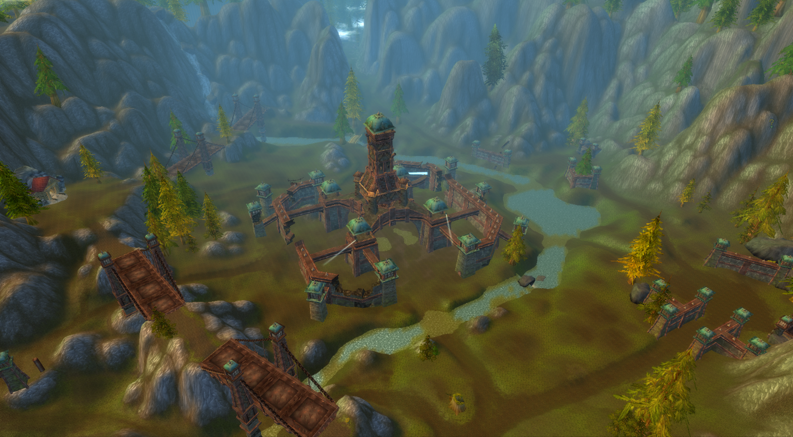
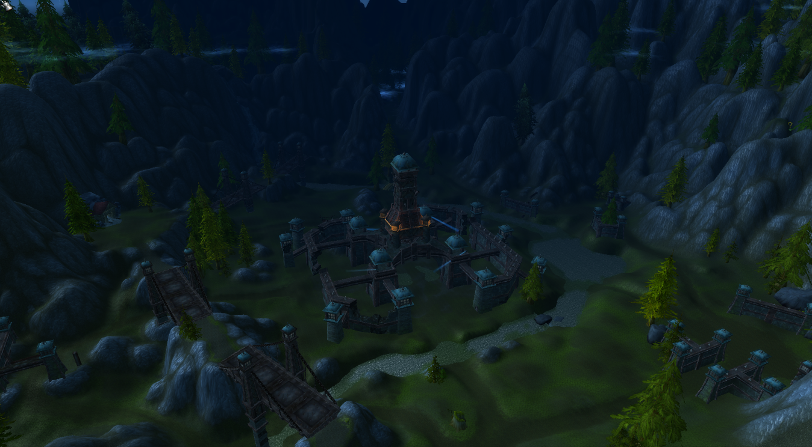
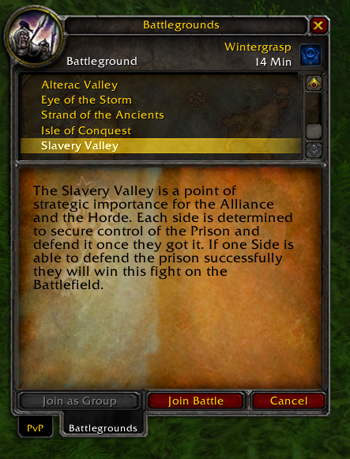
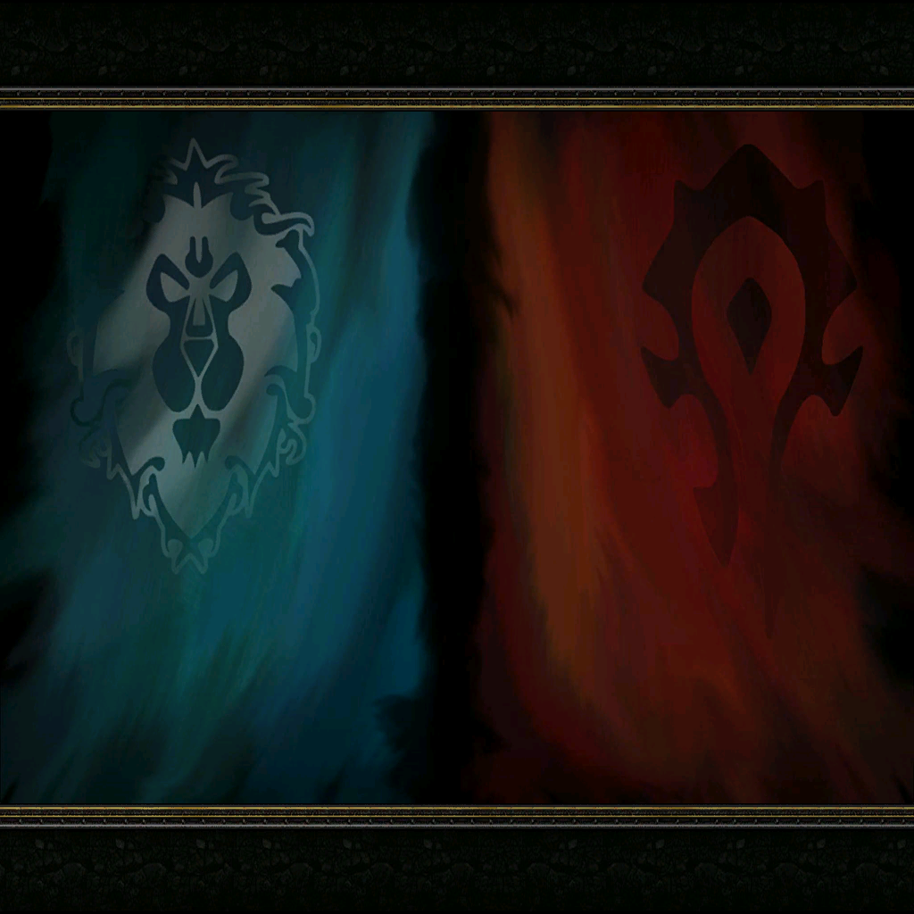
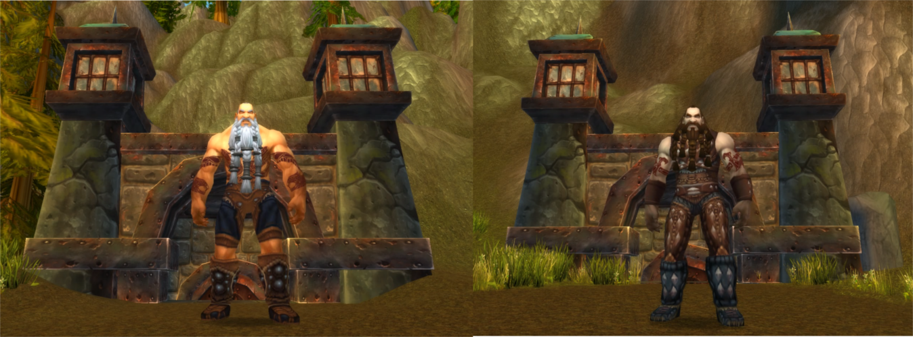

# Slavery Valley

## Description

This module add the battleground Slavery Valley.

### How the battleground works?

- Any faction has **80 points** (as default), the goal is decrease the points of the opposite faction by killing the players or the boss.
- There are three bases: **Mine, Restless Graveyard, Prison**.
- Restless Graveyard and Mine give you the **Spirit Healer** of the base.
- **Mine**, if taken, buffs the team with **Mine Buff**, it increases your damage by 5%.
- **Restless Graveyard**, if taken, buffs the team with **Restless Soul Graveyard Buff**, it increases your stamina.
- If you **kill a player** you inflict 1 point to the opposite faction, if you **take Prison** you inflict 2 points when you kill a player.
- The base Prison has no graveyard.
- There are two bosses one for each faction.
- When you kill a boss inflict 10 points to the opposite faction, if you took all the bases, when you kill the boss you inflict 25 points to the opposite faction.
- If one of the two bosses die, the other boss disappear.
- The bosses (re)spawn after 5 minutes.







# Bosses


## Requirements

This module requires:

- AzerothCore v2 from [this revision](https://github.com/azerothcore/azerothcore-wotlk/commit/75bf44d1684048b02bc338877fb11a62647a6896)


## Installation

**Server-side**

Install the module step by step:
```
1) Simply place the module under the `modules` directory of your AzerothCore source. 
2) Import the SQL manually to the right Database (auth, world or characters) or with the `db_assembler.sh` (if `include.sh` provided).
3) Re-run cmake and launch a clean build of AzerothCore.
```

Here the client data files to load the battleground data.  
[Download DBC](https://mega.nz/#!ckx0RIDS!Zcpm_w9LPMeiMlHLw_TWP9UPwOssUvvN_FSsjeRpvSg)  
[Download Maps](https://mega.nz/#!5pxWiYQQ!XyzvqUVYMKx3gUefRP3lBq3q4CX6fcuGN1hUeH9D9ms)  
[Download Vmaps](https://mega.nz/#!I1xzwIJI!mx9D4Rbdz9kt_dq4EKUs5K52GJcPp4h9qQ1HEozvSZQ)  
[Download Mmaps](https://mega.nz/#!5xpHGYKB!J_4xbEXVVsDWaqHY-DR_mcALUo7CQWcG36h0wlZBSV0)

Downloaded the files put them in your server/data/ folder, you need to overwrite the old dbc files and just add the others.


**Client-Side**

You need to download the [patch-S.mpq](https://mega.nz/#!JwgygYoY!8cXKi0BmnPFWRKae_ZxUS0ikjwFWy6cWI8lqB_noowQ) and put it in your *WoW/Data/* folder.

To use this patch correctly you need this wow.exe cracked version, you can take it from [here](https://mega.nz/#!Q5QR1SjJ!Arg1O1F7Mr5U6tE9aZcH0iFndYcGBK_AmfvZTn4kUjg)

**WARNING**: if you use this patch your WoW/enUS/backup-enUS.MPQ and WoW/enUS/lichking-locale-enUS.MPQ files will be overwritten, to recover them you can download them from these links:  
[backup-enUS.MPQ](https://mega.nz/#!84IHHaBI!NpaZGxT1MlcIAiD3TwDZ6uYZx4E1SoJPVuuhrEXytB8)  
[lichking-locale-enUS.MPQ](https://mega.nz/#!0gJx3IAb!uX1aOK0pig7Nc0MIN9COe31hc7ojR-amSkhB2ifi4uI)


## Edit module configuration (optional)

If you need to change the module configuration, go to your server configuration folder (where your `worldserver` or `worldserver.exe` is), copy `slavery_valley.conf.dist` to `slavery_valley.conf` and edit that new file.


## TODO

- Fix the config system


## Credits

* [Helias](https://github.com/Helias)
* [Snoopzz](http://www.modcraft.io/index.php?topic=10882.0)

AzerothCore: [repository](https://github.com/azerothcore) - [website](http://azerothcore.org/) - [discord chat community](https://discord.gg/PaqQRkd)
